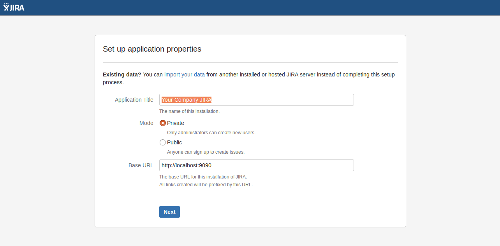

# jira-datacenter-docker
A Docker Compose script to generate a test JIRA datacenter environment

## Usage

First, clone the repo and start the containers

```bash
git clone https://github.com/fllaca/jira-datacenter-docker

cd jira-datacenter-docker
# this init script is necessary to change the permissions of the JIRA home folders so the JIRA daemon can write to them
./init.sh
docker-compose up -d
```

Then you can go to [http://localhost:9090](http://localhost:9090) and configure the initial setup for JIRA:



After that, restart node2 to reconnect it to database. Then you can go to your 80 port (the one the balancer is listening on) and connect to JIRA: [http://localhost](http://localhost). You can change the ports editing `docker-compose.yml`


